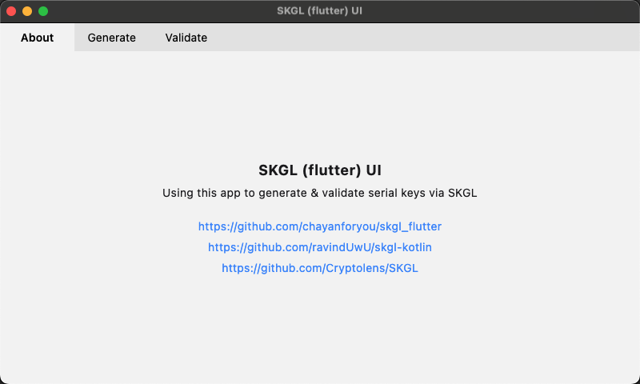
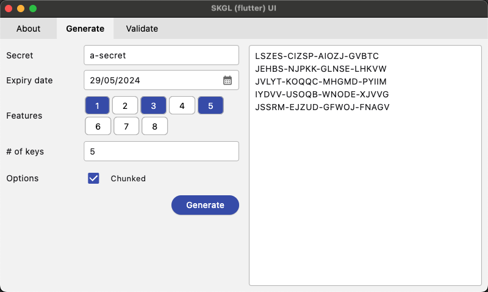
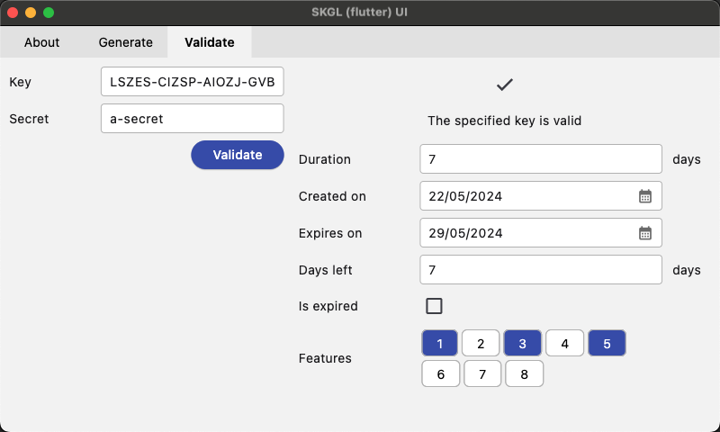

# SKGL (flutter)

[](https://pub.dartlang.org/packages/skgl_flutter) [](https://opensource.org/license/bsd-3-clause)

The [SKGL](https://github.com/Cryptolens/SKGL) library, written in Kotlin, with a shiny new API. Use this to generate &
validate human readable, 20-character serial keys with up to 8 features embedded.

## Installation

Add `skgl_flutter` as a dependency in your _pubspec.yaml_ file.

Import SKGL:
```dart
import 'package:skgl_flutter/skgl_flutter.dart';
```

### Generate a Key

```dart
final key = SerialKey.build('a-secret',
    config: SerialKeyBuildConfig(
      features: {1, 3, 5},
      duration: 30,
      chunk: true,
    ));

print(key.text); // XXXXX-XXXXX-XXXXX-XXXXX
```

### Decode a Key

```dart
final key = SerialKey('XXXXX-XXXXX-XXXXX-XXXXX', 'a-secret');

var createdOn = key.createdOn;
var expiresOn = key.expiresOn;
var features = key.features;
var isExpired = key.calculateIsExpired();
var daysLeft = key.calculateDaysLeft();
```

## UI

The [flutter](https://flutter.dev/)-powered [example](example) project can be used to generate or validate keys,





